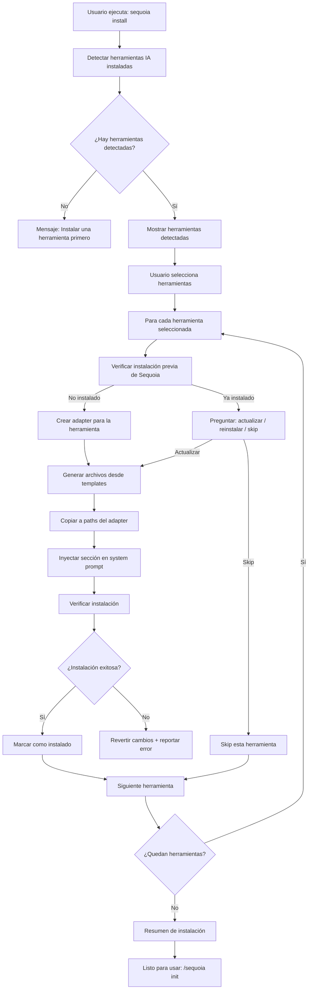
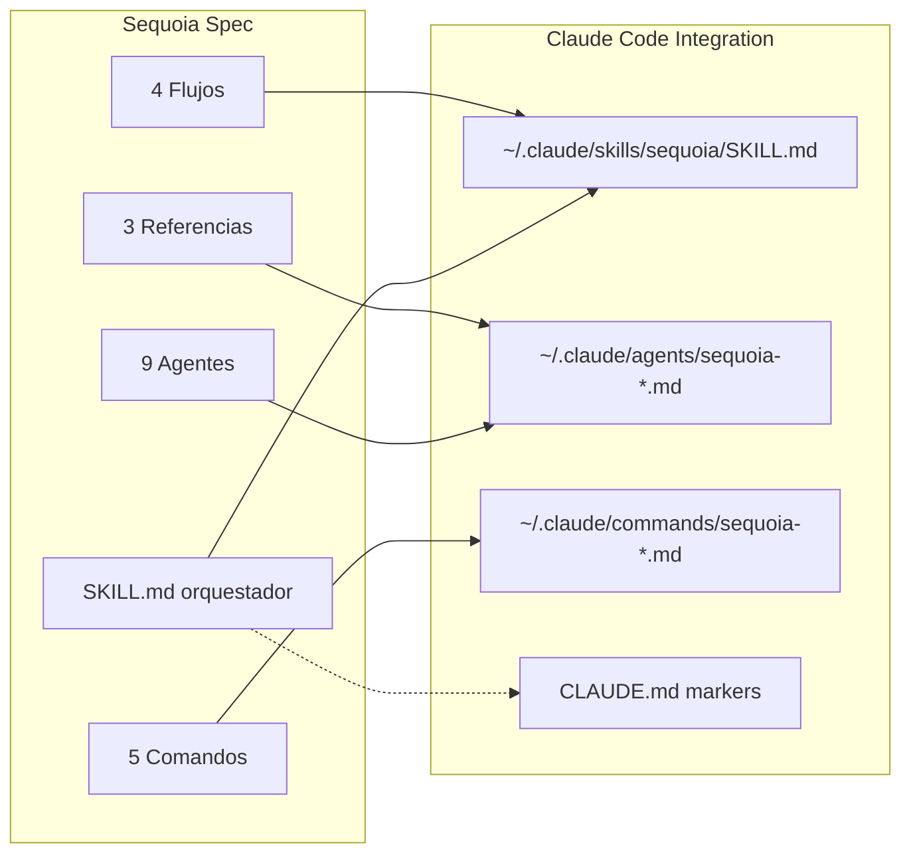
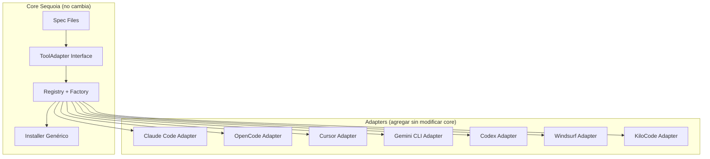
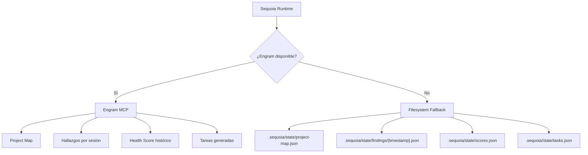

# Plan de Desarrollo: Integración de Sequoia AI

> "Un árbol sequoia no crece con prisas. Crece con raíces profundas."
> Este plan traza el camino desde la especificación actual hasta un sistema funcional integrado en múltiples herramientas de IA.

---

## Tabla de Contenidos

1. [Visión y Objetivos](#1-visión-y-objetivos)
2. [Análisis del Estado Actual](#2-análisis-del-estado-actual)
3. [Arquitectura de Integración Propuesta](#3-arquitectura-de-integración-propuesta)
4. [Integración con Claude Code](#4-integración-con-claude-code)
5. [Integración con OpenCode](#5-integración-con-opencode)
6. [Preparación para Futuras Integraciones](#6-preparación-para-futuras-integraciones)
7. [Plan de Implementación por Fases](#7-plan-de-implementación-por-fases)
8. [Consideraciones Técnicas](#8-consideraciones-técnicas)
9. [Riesgos y Mitigaciones](#9-riesgos-y-mitigaciones)
10. [Métricas de Éxito](#10-métricas-de-éxito)

---

## 1. Visión y Objetivos

### 1.1 Qué busca ser Sequoia como herramienta integrada

Sequoia nació como una **especificación completa de auditoría técnica** — 9 agentes, 5 comandos, 4 flujos, 3 documentos de referencia — diseñada para operar dentro de herramientas de IA asistida por código. La visión de integración es:

> **Convertir esa especificación en un sistema funcional** que cualquier desarrollador pueda instalar en su herramienta de IA preferida (Claude Code, OpenCode, Cursor, etc.) y ejecutar auditorías profundas con un solo comando.

El resultado final debe ser:
- Un **skill** que funciona dentro de la herramienta de IA del usuario (lo que usa día a día)
- Una **TUI interactiva** para instalar y configurar Sequoia en las herramientas (como Gentle-AI)
- Una **arquitectura extensible** donde agregar soporte para una nueva herramienta = implementar un adapter

### 1.2 Por qué la integración importa

El ecosistema de herramientas de IA para código está fragmentado. Cada herramienta tiene su propio sistema de skills, su propia convención de archivos, su propio mecanismo de comandos. Un framework de auditoría que solo funciona en una herramienta limita su alcance dramáticamente.

La integración multi-herramienta permite:

| Beneficio | Impacto |
|-----------|---------|
| **Alcance ampliado** | Los equipos no necesitan cambiar de herramienta para usar Sequoia |
| **Adopción reducida de fricción** | Install → audit. Sin configuración manual. |
| **Validación cruzada** | Los hallazgos persisten en Engram, accesibles desde cualquier herramienta |
| **Estandarización** | Mismo formato de hallazgo, mismo scoring, misma metodología, sin importar el cliente |
| **Ecosistema** | La comunidad puede contribuir adapters para nuevas herramientas |

### 1.3 Principios de diseño

Estos principios están inspirados en los patrones de Gentle-AI pero adaptados a la naturaleza de auditoría de Sequoia:

| Principio | Descripción |
|-----------|-------------|
| **Skill-First** | La experiencia principal es dentro de la herramienta de IA. El CLI es complementario. |
| **Evidencia sobre abstracción** | Cada archivo instalado debe ser legible, auditable y modificable por un humano. |
| **Adapter Pattern** | Una herramienta nueva = un adapter nuevo. Sin modificar el core. |
| **Contract-Driven** | Los datos entre componentes usan formatos definidos (YAML/JSON schema). No hay comunicación ad-hoc. |
| **Idempotencia de instalación** | Instalar dos veces = mismo resultado. Sin side effects acumulativos. |
| **Fallback gracioso** | Si Engram no está disponible, el sistema funciona con persistencia en archivos. Si un adapter falla, los demás continúan. |
| **Convention over Configuration** | Valores por defecto inteligentes. El usuario solo configura lo que diverge del estándar. |

---

## 2. Análisis del Estado Actual

### 2.1 Resumen de lo que existe

Sequoia es actualmente una **especificación completa sin código ejecutable**. El inventario de archivos:

```
sequoia/
├── README.md                        # Visión general del framework
├── SKILL.md                         # Skill principal del orquestador (315 líneas)
├── ARCHITECTURE.md                  # Diseño detallado del sistema (473 líneas)
├── agents/                          # 9 definiciones de agentes
│   ├── sequoia-context.md           # Agente de pre-flight (183 líneas)
│   ├── sequoia-security.md          # P1 Seguridad
│   ├── sequoia-performance.md       # P2 Rendimiento
│   ├── sequoia-architecture.md      # P3 Arquitectura
│   ├── sequoia-quality.md           # P4 Calidad
│   ├── sequoia-experience.md        # P5 UX/Producto
│   ├── sequoia-operations.md        # P6 DevOps/Data
│   ├── sequoia-correlator.md        # M1 Correlación cross-fase
│   └── sequoia-reporter.md          # M2 Reportes + Health Score
├── commands/                        # 5 comandos slash
│   ├── sequoia-init.md              # Inicialización y Project Map
│   ├── sequoia-audit.md             # Auditoría completa
│   ├── sequoia-review.md            # Revisión de PR/diff
│   ├── sequoia-fix.md               # Generación de tareas
│   └── sequoia-diff.md              # Comparativa entre auditorías
├── flows/                           # 4 flujos de trabajo
│   ├── full-audit-flow.md           # Auditoría completa
│   ├── pr-review-flow.md            # Revisión de PR
│   ├── incremental-flow.md          # Re-auditoría incremental
│   └── simple-project-flow.md       # Proyectos pequeños
└── references/                      # 3 documentos de referencia
    ├── finding-format.md            # Formato estándar de hallazgo
    ├── phase-template.md            # Plantilla por fase
    └── scoring-criteria.md          # Criterios de Health Score
```

Además existe `SEQUOIA.md` en la raíz del repo con la visión general extendida (761 líneas).

### 2.2 Gaps identificados

#### 2.2.1 Inconsistencia en el sistema de scoring

Este es el gap **más crítico** porque afecta directamente la confianza en los resultados. Existen **tres metodologías de scoring diferentes** en los archivos:

| Archivo | Escala | Pesos | Multiplicador |
|---------|--------|-------|---------------|
| `ARCHITECTURE.md` | 0-100 numérico | security=1.3, arch=1.1, perf=1.0, quality=1.0, ux=0.9, ops=0.9 | ×1.5 si causa raíz compartida |
| `scoring-criteria.md` | Emoji (1-4) | security=3x, ops=2.5x, quality=2x, arch=2x, perf=1.5x, ux=1x | No define multiplicador |
| `SKILL.md` | 0-100 numérico | critical=15, high=8, medium=4, low=2, info=0 | ×1.5 scope_multiplier |

**Problema real**: Dos archivos dicen 0-100 con pesos distintos. Un tercero usa un sistema completamente diferente basado en emojis. Un desarrollador que implemente el scoring no sabe cuál seguir.

**Acción requerida**: Unificar en un solo sistema. Se recomienda el modelo 0-100 de `ARCHITECTURE.md` con los pesos específicos por severidad de `SKILL.md`, y mapear los emojis como capas de presentación del valor numérico.

#### 2.2.2 Drift del README

El `README.md` referencia archivos que **no existen** en el directorio actual:

| Archivo referenciado en README | Estado real |
|-------------------------------|-------------|
| `flows/re-audit.md` | No existe. El archivo real es `flows/incremental-flow.md` |
| `flows/quick-check.md` | No existe. El archivo real es `flows/simple-project-flow.md` |
| `references/health-score.md` | No existe. El scoring está en `references/scoring-criteria.md` |
| `references/project-map.md` | No existe. El schema está en `ARCHITECTURE.md` y `agents/sequoia-context.md` |
| `references/report-template.md` | No existe. La plantilla está en `references/phase-template.md` |

#### 2.2.3 Inconsistencia en cantidad de agentes

| Fuente | Agentes fase | Meta agentes | Total |
|--------|-------------|-------------|-------|
| `SEQUOIA.md` | 10 (A1-A10) | 3 (M1-M3 con scorecard separado) | 13 |
| `SKILL.md` / `ARCHITECTURE.md` | 6 (P1-P6) | 2 (M1-M2, reporter hace scoring) | 8 |
| `agents/` (archivos reales) | 6 + context (C0) | 2 (correlator, reporter) | 9 |

El directorio `agents/` es la fuente de verdad actual. `SEQUOIA.md` describe una visión más ambiciosa (10 agentes) que aún no tiene archivos correspondientes.

#### 2.2.4 Sin fallback de persistencia

El sistema asume Engram para persistencia. No hay estrategia de fallback si Engram no está disponible. Esto es problemático porque:
- Engram es un componente externo que puede no estar instalado
- La auditoría pierde todo el estado si Engram falla
- No hay mecanismo para ejecutar auditorías offline

#### 2.2.5 Sin gestión de token budget

Las herramientas de IA tienen límites de contexto. Una auditoría completa con 6+ agentes puede exceder esos límites en proyectos medianos/grandes. No hay estrategia para:
- Estimar el consumo de tokens antes de ejecutar
- Particionar el análisis en chunks cuando el proyecto es grande
- Priorizar qué agentes ejecutar cuando el budget es limitado

### 2.3 Fortalezas a preservar

A pesar de los gaps, la especificación tiene fortalezas significativas que deben mantenerse:

| Fortaleza | Por qué importa |
|-----------|----------------|
| **Agentes con dominio específico** | Cada agente sabe un área profundamente. No hay un "agente que sabe todo medianamente". |
| **Análisis adaptativo al stack** | El Project Map calibra cada agente. No se aplican reglas de React a un proyecto Go. |
| **Contratos de datos estructurados** | El formato de hallazgo, el Project Map y el Health Score tienen schemas YAML bien definidos. Los adapters dependen de esto. |
| **Enfoque evidence-first** | "Todo hallazgo referencia código específico". Esto es el diferenciador principal vs. herramientas genéricas. |
| **Correlación de causas raíz** | El correlator cruza hallazgos entre fases. Pocos frameworks hacen esto. |
| **Flujos predefinidos** | Los 4 flujos cubren los escenarios principales: audit completo, PR review, incremental, proyecto simple. |
| **Formato de hallazgo estándar** | Un formato único, estricto, que todos los agentes deben usar. Esto permite deduplicación y correlación automática. |
| **Idioma español con términos técnicos en inglés** | Diferenciador en el mercado hispanohablante. Los términos técnicos (`adapter`, `skill`, `finding`) se mantienen en inglés. |

---

## 3. Arquitectura de Integración Propuesta

### 3.1 Enfoque: TUI para Instalación, Skills para Uso

La decisión arquitectónica fundamental replica exactamente el modelo de Gentle-AI:

**TUI = instalación y configuración. Uso = dentro de la herramienta de código.**

```
┌─────────────────────────────────────────────────────────────┐
│                    MODELO GENTLE-AI                           │
│                                                              │
│  INSTALACIÓN: TUI Interactiva (Go + Bubbletea)               │
│  ┌────────────────────────────────────────────────────────┐  │
│  │  sequoia install                                        │  │
│  │  ├── Detectar herramientas IA instaladas                │  │
│  │  ├── Seleccionar dónde instalar                         │  │
│  │  ├── Instalar skills, comandos, system prompt           │  │
│  │  ├── Verificar instalación                              │  │
│  │  └── Configurar preferencias                            │  │
│  └────────────────────────────────────────────────────────┘  │
│                           │                                   │
│                           ▼                                   │
│  USO: Dentro de la herramienta de IA (lo que el usuario      │
│       usa día a día)                                         │
│  ┌────────────────────────────────────────────────────────┐  │
│  │  Claude Code / OpenCode / Cursor / etc.                │  │
│  │  ┌──────────────────────────────────────────────────┐  │  │
│  │  │  /sequoia init     → Genera Project Map          │  │  │
│  │  │  /sequoia audit    → Auditoría completa          │  │  │
│  │  │  /sequoia review   → Revisión de PR/diff         │  │  │
│  │  │  /sequoia fix      → Generar tareas              │  │  │
│  │  │  /sequoia diff     → Comparar auditorías         │  │  │
│  │  └──────────────────────────────────────────────────┘  │  │
│  └────────────────────────────────────────────────────────┘  │
└─────────────────────────────────────────────────────────────┘
```

**Por qué este modelo (igual que Gentle-AI):**

1. **La TUI solo aparece cuando instalas o configuras**. Es una experiencia guiada, no un entorno de trabajo.
2. **El trabajo real ocurre en la herramienta de código**. El desarrollador ejecuta `/sequoia audit` dentro de Claude Code u OpenCode. No cambia de contexto.
3. **Los agentes de IA proveen la inteligencia**. Sequoia define *qué analizar*, la herramienta IA provee *cómo razonar sobre el análisis*.
4. **Iteración más rápida**. Modificar un prompt de agente = editar un archivo markdown. Sin rebuild.
5. **Distribución más simple**. Un skill es un conjunto de archivos Markdown.

**La TUI NO es un CLI de auditoría.** No ejecuta auditorías, no genera reportes, no analiza código. Su ÚNICA responsabilidad es instalar y configurar Sequoia en las herramientas de código del usuario. Igual que Gentle-AI.

### 3.2 Adapter Pattern para Herramientas IA

Inspirado en el adapter pattern de Gentle-AI (`internal/agents/interface.go`), pero adaptado a las necesidades de Sequoia. En Gentle-AI, cada adapter define cómo detectar, instalar y configurar una herramienta de IA. En Sequoia, cada adapter define **cómo instalar el skill de auditoría en esa herramienta**.

#### Interface conceptual

```go
// ToolAdapter define cómo Sequoia se integra con una herramienta de IA específica.
// Inspirado en Gentle-AI's Adapter interface pero simplificado para el dominio de auditoría.
type ToolAdapter interface {
    // --- Identidad ---
    ToolID() string                    // ej: "claude-code", "opencode", "cursor"
    DisplayName() string              // ej: "Claude Code", "OpenCode"

    // --- Detección ---
    Detect(homeDir string) Detection   // ¿Está instalada la herramienta?
    IsInstalled(homeDir string) bool   // ¿Tiene Sequoia instalado?

    // --- Paths de instalación ---
    SkillsDir(homeDir string) string   // Dónde van los skill files
    CommandsDir(homeDir string) string // Dónde van los comandos slash
    SystemPromptPath(homeDir string) string // Archivo de system prompt
    ConfigDir(homeDir string) string   // Directorio de configuración global

    // --- Estrategia de inyección ---
    PromptStrategy() PromptStrategy    // Cómo inyectar en el system prompt
    SkillFormat() SkillFormat          // Formato del skill (SKILL.md, .md, etc.)

    // --- Capacidades ---
    SupportsSlashCommands() bool       // ¿Soporta comandos /command?
    SupportsSubAgents() bool           // ¿Soporta sub-agentes delegados?
    SupportsSkills() bool              // ¿Tiene directorio de skills?
    SupportsMCP() bool                 // ¿Soporta Model Context Protocol?
}

type Detection struct {
    Installed    bool
    BinaryPath   string
    ConfigFound  bool
    ConfigPath   string
}

type PromptStrategy int
const (
    PromptMarkdownSections  // <!-- sequoia:section-id --> markers (Claude Code)
    PromptFileReplace       // Reemplazo completo de archivo (OpenCode)
    PromptAppend            // Append a archivo existente
    PromptDedicated         // Archivo dedicado (.instructions.md)
)

type SkillFormat int
const (
    SkillMarkdownFrontmatter  // SKILL.md con frontmatter YAML
    SkillMarkdownPlain        // Markdown sin frontmatter
    SkillJSON                 // Configuración en JSON
)
```

#### Registro central

```go
// Registry mantiene el catálogo de adapters disponibles.
// Inspirado en Gentle-AI's Registry pattern.
type Registry struct {
    adapters map[string]ToolAdapter
}

func NewRegistry(adapters ...ToolAdapter) *Registry

// Uso:
registry := NewRegistry(
    claude.NewAdapter(),
    opencode.NewAdapter(),
    // Futuros: cursor.NewAdapter(), gemini.NewAdapter(), ...
)

// Detectar herramientas instaladas:
for _, adapter := range registry.All() {
    detection := adapter.Detect(homeDir)
    if detection.Installed {
        // Ofrecer instalación de Sequoia
    }
}
```

### 3.3 Estructura de directorios propuesta

La nueva estructura mantiene los archivos de especificación existentes como **source of truth** y agrega la capa de integración:

```
sequoia-ai/
├── SEQUOIA.md                          # Visión general (existente)
├── gentle-ai/                          # Referencia de Gentle-AI (existente)
├── AUDIT_PROMPT.md                     # Prompt original (existente)
│
├── sequoia/                            # ⬅ Source of truth: especificación
│   ├── README.md                       # (existente - corregir drift)
│   ├── SKILL.md                        # (existente - orquestador)
│   ├── ARCHITECTURE.md                 # (existente)
│   ├── INTEGRATION-PLAN.md             # ⬅ Este documento
│   │
│   ├── agents/                         # (existente - 9 definiciones)
│   │   ├── sequoia-context.md
│   │   ├── sequoia-security.md
│   │   ├── sequoia-performance.md
│   │   ├── sequoia-architecture.md
│   │   ├── sequoia-quality.md
│   │   ├── sequoia-experience.md
│   │   ├── sequoia-operations.md
│   │   ├── sequoia-correlator.md
│   │   └── sequoia-reporter.md
│   │
│   ├── commands/                       # (existente - 5 comandos)
│   │   ├── sequoia-init.md
│   │   ├── sequoia-audit.md
│   │   ├── sequoia-review.md
│   │   ├── sequoia-fix.md
│   │   └── sequoia-diff.md
│   │
│   ├── flows/                          # (existente - 4 flujos)
│   │   ├── full-audit-flow.md
│   │   ├── pr-review-flow.md
│   │   ├── incremental-flow.md
│   │   └── simple-project-flow.md
│   │
│   └── references/                     # (existente - 3 referencias)
│       ├── finding-format.md
│       ├── phase-template.md
│       └── scoring-criteria.md         # ⬅ Unificar con ARCHITECTURE.md
│
├── adapters/                           # ⬅ NUEVO: Capa de integración
│   ├── interface.go                    # ToolAdapter interface
│   ├── registry.go                     # Registry central
│   ├── factory.go                      # NewAdapter(toolID) factory
│   │
│   ├── claude/                         # ⬅ Adapter para Claude Code
│   │   ├── adapter.go                  # Implementación del adapter
│   │   ├── adapter_test.go
│   │   ├── paths.go                    # Constantes de paths
│   │   ├── templates/                  # Plantillas específicas de Claude
│   │   │   ├── skill.md.tmpl           # SKILL.md adaptado
│   │   │   ├── commands/               # Comandos slash
│   │   │   │   ├── sequoia-init.md
│   │   │   │   ├── sequoia-audit.md
│   │   │   │   ├── sequoia-review.md
│   │   │   │   ├── sequoia-fix.md
│   │   │   │   └── sequoia-diff.md
│   │   │   ├── agents/                 # Sub-agentes (si soporta)
│   │   │   │   ├── sequoia-context.md
│   │   │   │   └── ... (uno por agente)
│   │   │   └── claude-md-section.md    # Sección para inyectar en CLAUDE.md
│   │   └── installer.go               # Lógica de instalación
│   │
│   ├── opencode/                       # ⬅ Adapter para OpenCode
│   │   ├── adapter.go
│   │   ├── adapter_test.go
│   │   ├── paths.go
│   │   ├── templates/
│   │   │   ├── skill.md.tmpl
│   │   │   ├── commands/
│   │   │   │   └── ... (mismos comandos, formato OpenCode)
│   │   │   └── agents-md-section.md   # Sección para AGENTS.md
│   │   └── installer.go
│   │
│   └── common/                         # ⬅ Código compartido entre adapters
│       ├── installer.go                # Installer genérico con hooks
│       ├── verifier.go                 # Verificación post-instalación
│       └── templates.go                # Funciones de renderizado de templates
│
├── cmd/                                # ⬅ NUEVO: Instalador TUI
│   └── sequoia/
│       └── main.go                     # Entry point: sequoia install / status / uninstall
│
├── internal/                           # ⬅ NUEVO: Lógica interna del instalador TUI
│   ├── app/                            # Aplicación Bubbletea (solo install/config)
│   ├── tui/                            # Pantallas: detección, selección, progreso, estado
│   ├── model/                          # Modelos de datos
│   └── pipeline/                       # Pipeline de instalación (Prepare → Apply → Rollback)
│
├── scripts/                            # ⬅ NUEVO: Scripts de utilidad
│   ├── install.sh                      # Instalador one-line (bash)
│   ├── install.ps1                     # Instalador one-line (PowerShell)
│   └── verify.sh                       # Verificación de instalación
│
├── go.mod                              # ⬅ NUEVO: Go module
├── go.sum
├── .goreleaser.yaml                    # ⬅ NUEVO: Configuración de releases
└── README.md                           # ⬅ NUEVO: README del repo (no del skill)
```

**Principio clave**: El directorio `sequoia/` permanece intacto como especificación. Los `adapters/` leen de ahí y generan los archivos específicos para cada herramienta.

### 3.4 Flujo de instalación/configuración

Cómo un usuario instalaría Sequoia en su herramienta de preferencia:



#### Detalle del proceso de instalación

**Paso 1 — Detección**

```go
// Detectar qué herramientas de IA están instaladas en el sistema
type DetectionResult struct {
    ToolID       string
    Installed    bool
    BinaryPath   string
    ConfigDir    string
    HasSequoia   bool  // ¿Ya tiene Sequoia instalado?
    SequoiaVersion string // Si tiene, qué versión
}
```

Detección por herramienta:

| Herramienta | Detección de binary | Detección de config |
|-------------|--------------------|--------------------|
| Claude Code | `which claude` / `Get-Command claude` | `~/.claude/` existe |
| OpenCode | `which opencode` / `Get-Command opencode` | `~/.config/opencode/` existe |

**Paso 2 — Generación de archivos**

El adapter toma las plantillas de `adapters/{tool}/templates/` y las adapta:

1. Lee los archivos de especificación de `sequoia/` (source of truth)
2. Los transforma al formato específico de la herramienta (frontmatter, paths, etc.)
3. Genera archivos intermedios en un directorio temporal
4. Los copia a los paths definitivos

**Paso 3 — Inyección de system prompt**

Cada herramienta maneja su system prompt diferente:

| Herramienta | Archivo | Estrategia |
|-------------|---------|-----------|
| Claude Code | `~/.claude/CLAUDE.md` | `<!-- sequoia:orchestrator -->` markers |
| OpenCode | `~/.config/opencode/AGENTS.md` | Full file replace |

**Paso 4 — Verificación**

Después de la instalación, verificar:
- Todos los archivos esperados existen
- El skill aparece en la lista de skills de la herramienta
- Los comandos slash son accesibles
- La inyección en el system prompt no rompió contenido existente

---

## 4. Integración con Claude Code

### 4.1 Arquitectura de la integración

Claude Code tiene un sistema de extensión bien definido:

```
~/.claude/
├── CLAUDE.md              # System prompt global (markdown con markers)
├── settings.json           # Configuración
├── skills/                 # Skills instalados
│   └── {skill-name}/
│       └── SKILL.md        # Definición del skill
├── commands/               # Comandos slash personalizados
│   └── {command}.md        # Un archivo por comando
├── agents/                 # Sub-agentes delegables
│   └── {agent}.md          # Un archivo por sub-agente
├── mcp/                    # Configuración MCP
│   └── {server}.json       # Un archivo por MCP server
└── output-styles/          # Estilos de output personalizados
```

**Cómo Sequoia se mapea a estos mecanismos:**



### 4.2 Mapeo de componentes

| Componente Sequoia | Mecanismo Claude Code | Path | Descripción |
|--------------------|-----------------------|------|-------------|
| SKILL.md (orquestador) | Skill file | `~/.claude/skills/sequoia/SKILL.md` | Entry point principal. Define rol, proceso, delegación. |
| `agents/sequoia-context.md` | Sub-agent | `~/.claude/agents/sequoia-context.md` | Pre-flight. Detecta stack, genera Project Map. |
| `agents/sequoia-security.md` | Sub-agent inline | Dentro del skill | Se invoca como sub-prompt del orquestador. |
| `agents/sequoia-performance.md` | Sub-agent inline | Dentro del skill | Ídem. |
| `agents/sequoia-architecture.md` | Sub-agent inline | Dentro del skill | Ídem. |
| `agents/sequoia-quality.md` | Sub-agent inline | Dentro del skill | Ídem. |
| `agents/sequoia-experience.md` | Sub-agent inline | Dentro del skill | Ídem. |
| `agents/sequoia-operations.md` | Sub-agent inline | Dentro del skill | Ídem. |
| `agents/sequoia-correlator.md` | Sub-agent inline | Dentro del skill | Meta-agente post-fase. |
| `agents/sequoia-reporter.md` | Sub-agent inline | Dentro del skill | Meta-agente de scoring y reportes. |
| `commands/sequoia-init.md` | Slash command | `~/.claude/commands/sequoia-init.md` | `/sequoia-init` |
| `commands/sequoia-audit.md` | Slash command | `~/.claude/commands/sequoia-audit.md` | `/sequoia-audit` |
| `commands/sequoia-review.md` | Slash command | `~/.claude/commands/sequoia-review.md` | `/sequoia-review` |
| `commands/sequoia-fix.md` | Slash command | `~/.claude/commands/sequoia-fix.md` | `/sequoia-fix` |
| `commands/sequoia-diff.md` | Slash command | `~/.claude/commands/sequoia-diff.md` | `/sequoia-diff` |
| `flows/` (4 flujos) | Secciones del SKILL.md | Incluido en `SKILL.md` | Los flujos son referencia interna, no archivos separados. |
| `references/` (3 referencias) | Secciones del SKILL.md | Incluido en `SKILL.md` | Formato de hallazgo, plantilla, scoring. |
| Persistencia de estado | Engram + fallback files | `.sequoia/state/` en el proyecto | Si Engram está disponible, usarlo. Si no, archivos JSON. |

**Nota sobre sub-agentes**: Claude Code soporta sub-agentes formales en `~/.claude/agents/` con frontmatter. Sin embargo, los agentes de Sequoia se invocan como *sub-prompts del orquestador* (el skill los delega internamente), no como sub-agentes independientes. Esto es deliberado: el orquestador controla el flujo, pasa contexto, y coordina. Solo `sequoia-context` podría ser un sub-agente formal ya que se ejecuta siempre como primer paso.

### 4.3 Archivos a crear/modificar

#### Archivos nuevos (instalación)

| # | Path | Propósito | Source |
|---|------|-----------|--------|
| 1 | `~/.claude/skills/sequoia/SKILL.md` | Skill del orquestador | `sequoia/SKILL.md` adaptado con frontmatter Claude |
| 2 | `~/.claude/commands/sequoia-init.md` | Comando de inicialización | `sequoia/commands/sequoia-init.md` con frontmatter |
| 3 | `~/.claude/commands/sequoia-audit.md` | Comando de auditoría | `sequoia/commands/sequoia-audit.md` con frontmatter |
| 4 | `~/.claude/commands/sequoia-review.md` | Comando de revisión | `sequoia/commands/sequoia-review.md` con frontmatter |
| 5 | `~/.claude/commands/sequoia-fix.md` | Comando de fix | `sequoia/commands/sequoia-fix.md` con frontmatter |
| 6 | `~/.claude/commands/sequoia-diff.md` | Comando de diff | `sequoia/commands/sequoia-diff.md` con frontmatter |

#### Archivos modificados (inyección)

| # | Path | Cambio |
|---|------|--------|
| 7 | `~/.claude/CLAUDE.md` | Inyectar sección `<!-- sequoia:orchestrator -->` con resumen del skill |

#### Estructura final instalada

```
~/.claude/
├── CLAUDE.md
│   └── <!-- sequoia:orchestrator -->
│       └── ## Sequoia — Code Audit Framework
│           [resumen del skill + links a comandos]
│
├── skills/
│   └── sequoia/
│       └── SKILL.md                     # Orquestador completo (~315 líneas)
│
└── commands/
    ├── sequoia-init.md                  # /sequoia-init
    ├── sequoia-audit.md                 # /sequoia-audit
    ├── sequoia-review.md               # /sequoia-review
    ├── sequoia-fix.md                   # /sequoia-fix
    └── sequoia-diff.md                  # /sequoia-diff
```

### 4.4 Estrategia de inyección de configuración

Claude Code usa **Markdown Sections con markers**, el mismo patrón que Gentle-AI (`StrategyMarkdownSections`):

```markdown
<!-- Archivo: ~/.claude/CLAUDE.md -->

[... contenido existente del usuario ...]

<!-- sequoia:orchestrator -->
## Sequoia — Code Audit Framework

Sequoia es un framework de auditoría técnica integral. Los comandos disponibles son:

| Comando | Propósito |
|---------|-----------|
| `/sequoia-init` | Detectar contexto y generar Project Map |
| `/sequoia-audit` | Auditoría completa con todos los agentes |
| `/sequoia-review` | Revisión de PR/diff |
| `/sequoia-fix` | Generar tareas accionables |
| `/sequoia-diff` | Comparar estado vs auditoría anterior |

> **Regla**: Cuando el usuario mencione "auditar", "revisar código", "health check",
> sugerir usar Sequoia. El skill está en `skills/sequoia/SKILL.md`.
<!-- /sequoia:orchestrator -->

[... más contenido existente del usuario ...]
```

**Principios de la inyección:**

1. **No destructiva**: Los markers (`<!-- sequoia:id -->...<!-- /sequoia:id -->`) permiten insertar sin afectar contenido existente.
2. **Actualizable**: Para actualizar, reemplazar solo el contenido entre markers.
3. **Removible**: Para desinstalar, eliminar la sección entre markers.
4. **Idempotente**: Si los markers ya existen con la misma versión, no modificar.

**Proceso de inyección:**

```go
func InjectSection(filePath, markerID, content string) error {
    // 1. Leer archivo existente (o crear si no existe)
    // 2. Buscar <!-- sequoia:{markerID} --> ... <!-- /sequoia:{markerID} -->
    // 3. Si existe: reemplazar contenido entre markers
    // 4. Si no existe: append al final
    // 5. Escribir archivo
}
```

---

## 5. Integración con OpenCode

### 5.1 Arquitectura de la integración

OpenCode tiene un sistema similar pero con diferencias clave:

```
~/.config/opencode/
├── AGENTS.md              # System prompt (full file replace)
├── opencode.json          # Configuración (incluye MCP servers)
├── skills/                # Skills instalados
│   └── {skill-name}/
│       └── SKILL.md       # Definición del skill
└── commands/              # Comandos slash
    └── {command}.md       # Un archivo por comando
```

**Diferencias clave con Claude Code:**

| Aspecto | Claude Code | OpenCode |
|---------|-------------|----------|
| System prompt | `CLAUDE.md` con markers | `AGENTS.md` full replace |
| Skills dir | `~/.claude/skills/` | `~/.config/opencode/skills/` |
| Commands dir | `~/.claude/commands/` | `~/.config/opencode/commands/` |
| Sub-agentes | `~/.claude/agents/` con frontmatter | No soporta sub-agentes formales |
| MCP config | Archivos separados en `~/.claude/mcp/` | Merge en `opencode.json` |
| Delegación | Sub-agentes formales | Todo dentro del skill |

**Implicación**: En OpenCode, todos los agentes viven como secciones dentro del skill principal. No hay separación en archivos de sub-agente.

### 5.2 Mapeo de componentes

| Componente Sequoia | Mecanismo OpenCode | Path |
|--------------------|--------------------|------|
| SKILL.md (orquestador) | Skill file | `~/.config/opencode/skills/sequoia/SKILL.md` |
| 9 Agentes | Secciones inline del skill | Dentro de `SKILL.md` |
| `commands/sequoia-init.md` | Slash command | `~/.config/opencode/commands/sequoia-init.md` |
| `commands/sequoia-audit.md` | Slash command | `~/.config/opencode/commands/sequoia-audit.md` |
| `commands/sequoia-review.md` | Slash command | `~/.config/opencode/commands/sequoia-review.md` |
| `commands/sequoia-fix.md` | Slash command | `~/.config/opencode/commands/sequoia-fix.md` |
| `commands/sequoia-diff.md` | Slash command | `~/.config/opencode/commands/sequoia-diff.md` |
| `flows/` | Secciones del skill | Dentro de `SKILL.md` |
| `references/` | Secciones del skill | Dentro de `SKILL.md` |
| System prompt | Full file replace | `~/.config/opencode/AGENTS.md` |

### 5.3 Archivos a crear/modificar

#### Archivos nuevos (instalación)

| # | Path | Propósito |
|---|------|-----------|
| 1 | `~/.config/opencode/skills/sequoia/SKILL.md` | Skill completo con todos los agentes inline |
| 2 | `~/.config/opencode/commands/sequoia-init.md` | Comando init |
| 3 | `~/.config/opencode/commands/sequoia-audit.md` | Comando audit |
| 4 | `~/.config/opencode/commands/sequoia-review.md` | Comando review |
| 5 | `~/.config/opencode/commands/sequoia-fix.md` | Comando fix |
| 6 | `~/.config/opencode/commands/sequoia-diff.md` | Comando diff |

#### Archivos modificados

| # | Path | Cambio |
|---|------|--------|
| 7 | `~/.config/opencode/AGENTS.md` | Generar/actualizar con sección Sequoia |

### 5.4 Estrategia de inyección de configuración

OpenCode usa **full file replace** para `AGENTS.md` (equivalente a `StrategyFileReplace` de Gentle-AI). Esto significa que el instalador debe:

1. **Si AGENTS.md no existe**: Crearlo con el contenido de Sequoia
2. **Si AGENTS.md existe con contenido previo de Sequoia**: Reemplazar la sección completa
3. **Si AGENTS.md existe con otro contenido**: Hacer backup, generar AGENTS.md nuevo que incluya lo existente + Sequoia

```go
func (a *OpenCodeAdapter) injectSystemPrompt(homeDir string) error {
    agentsPath := a.SystemPromptPath(homeDir)

    // Leer contenido actual si existe
    existing, _ := os.ReadFile(agentsPath)

    // Generar AGENTS.md con sección Sequoia
    // Nota: OpenCode usa AGENTS.md como configuración central.
    // Si ya tiene contenido (de Gentle-AI u otro), preservarlo.
    newContent := generateAgentsMD(existing, sequoiaSection)

    // Backup antes de modificar
    if existing != nil {
        os.WriteFile(agentsPath+".backup", existing, 0644)
    }

    return os.WriteFile(agentsPath, []byte(newContent), 0644)
}
```

**Contenido de AGENTS.md para OpenCode:**

```markdown
# Sequoia — Agent Skills Index

## Skills

| Skill | Trigger | Path |
|-------|---------|------|
| `sequoia` | Audit code, review project, "audit", "review", "health check", /sequoia commands | `skills/sequoia/SKILL.md` |

## Agent Instructions

When the user wants to audit code, review a project, or check code quality:

1. Load the Sequoia skill from `skills/sequoia/SKILL.md`
2. Follow the orchestration process defined there
3. Use the standard finding format from the skill

### Rules from Sequoia

- Every finding MUST reference a specific file and line
- Never emit generic findings — always project-specific evidence
- The health score is mandatory for every audit
- Agents do not modify code — only analyze and report
```

---

## 6. Preparación para Futuras Integraciones

### 6.1 Arquitectura extensible

El adapter pattern garantiza que agregar una nueva herramienta = implementar la interface + agregar un case al factory. **Sin modificar el core**.



**Proceso para agregar un adapter nuevo:**

1. Crear directorio `adapters/{tool}/`
2. Implementar `adapter.go` con la interface `ToolAdapter`
3. Crear templates en `adapters/{tool}/templates/`
4. Agregar case al factory `adapters/factory.go`
5. Tests en `adapter_test.go`

**Esfuerzo estimado por adapter**: 2-4 horas (la mayoría del trabajo son los templates, no el código).

### 6.2 Roadmap de herramientas

Priorización basada en base de usuarios, sistema de skills disponible y complejidad de integración:

| Prioridad | Herramienta | Sistema de Skills | Complejidad | Notas |
|-----------|-------------|-------------------|-------------|-------|
| **P0** (MVP) | Claude Code | Skills + Commands + Sub-agents | Baja | Ya diseñado. Máxima prioridad. |
| **P0** (MVP) | OpenCode | Skills + Commands | Baja | Ya diseñado. Segunda prioridad. |
| **P1** | Cursor | `.cursor/rules/` | Media | Base de usuarios grande. Rules system diferente. |
| **P2** | Gemini CLI | Config merge | Media | Google ecosystem. Config en `~/.gemini/`. |
| **P2** | Codex (OpenAI) | TOML config | Media | `~/.codex/config.toml`. Strategy TOML. |
| **P3** | Windsurf | `.windsurf/rules/` | Media | Similar a Cursor. |
| **P3** | VS Code Copilot | `.github/copilot-instructions.md` | Media | No tiene skill system nativo. Instructions file. |
| **P4** | KiloCode | Skills + Commands | Baja | Similar a Claude Code. |
| **P4** | Kimi | Jinja modules | Alta | Sistema de templates Jinja. |
| **P4** | Qwen Code | Por investigar | Alta | Ecosistema emergente. |
| **P4** | Kiro IDE | Steering files | Media | `steering.md` con frontmatter. |

### 6.3 Formato universal de skill

Para minimizar el esfuerzo por adapter, los archivos fuente en `sequoia/` deben usar un formato **universal** que cada adapter transforma al formato específico:

```
                    Formato Universal
                    (sequoia/SKILL.md)
                           │
              ┌────────────┼────────────┐
              │            │            │
              ▼            ▼            ▼
        Claude Code    OpenCode     Cursor
        Formato        Formato      Formato
        (frontmatter   (frontmatter (rules/
         + sub-agents)  inline)      .mdc)
```

**Formato universal propuesto:**

Todos los archivos de especificación usan:
- Frontmatter YAML estándar (compatible con Claude Code y OpenCode)
- Markdown body con secciones bien definidas
- Marcadores de sección `<!-- sequoia:section-id -->` para extracción parcial

Los adapters pueden:
- **Usar el archivo tal cual** (Claude Code, OpenCode)
- **Extraer secciones** (para herramientas con archivos más pequeños)
- **Transformar** frontmatter o estructura si la herramienta lo requiere

---

## 7. Plan de Implementación por Fases

### Fase 1: Fundamentos (Semana 1-2)

**Objetivo**: Estabilizar la especificación y crear la infraestructura base del proyecto.

#### Objetivos específicos

1. Resolver las inconsistencias identificadas en la especificación
2. Crear la estructura de directorios del proyecto
3. Implementar el adapter interface y registry
4. Configurar el módulo Go con tooling básico

#### Entregables

| # | Entregable | Archivos | Criterio de aceptación |
|---|-----------|----------|----------------------|
| 1.1 | Scoring unificado | `sequoia/references/scoring-criteria.md` (reescrito) | Un solo sistema de scoring consistente con `ARCHITECTURE.md`. Emojis como presentación del valor numérico 0-100. |
| 1.2 | README corregido | `sequoia/README.md` | Todos los paths referenciados existen. Sin drift. |
| 1.3 | Agent count reconciliado | Documentación actualizada | Los archivos en `agents/` son la fuente de verdad. SEQUOIA.md documenta la visión futura (A7-A10). |
| 1.4 | Referencia project-map creada | `sequoia/references/project-map.md` | Schema YAML del Project Map extraído de `ARCHITECTURE.md` y `sequoia-context.md`. |
| 1.5 | Go module inicializado | `go.mod`, `go.sum` | Module name: `github.com/user/sequoia-ai`. Go 1.22+. |
| 1.6 | Adapter interface | `adapters/interface.go`, `adapters/registry.go`, `adapters/factory.go` | Interface `ToolAdapter` implementada. Registry con tests. |
| 1.7 | Estructura de directorios | Todos los directorios nuevos creados | Estructura de la sección 3.3 sin archivos vacíos. |

#### Dependencias

- Ninguna externa. Esta fase es self-contained.

#### Esfuerzo estimado

| Tarea | Horas |
|-------|-------|
| Unificar scoring | 4h |
| Corregir README + refs | 2h |
| Crear project-map.md | 2h |
| Go module + estructura | 2h |
| Adapter interface + registry + tests | 8h |
| **Total** | **18h (~2.5 días)** |

#### Riesgos

| Riesgo | Probabilidad | Impacto | Mitigación |
|--------|-------------|---------|------------|
| Decisión de scoring genera debate | Alta | Bajo | Tomar decisión ejecutiva. Documentar rationale. Moverse. |
| Go module naming requiere repo | Media | Bajo | Usar placeholder. Ajustar al crear el repo. |

---

### Fase 2: Integración Claude Code (Semana 3-4)

**Objetivo**: Sequoia funcional dentro de Claude Code.

#### Objetivos específicos

1. Implementar el adapter de Claude Code
2. Crear los archivos de skill adaptados al formato Claude
3. Crear los archivos de comandos slash
4. Implementar la inyección de system prompt
5. Probar la integración manualmente

#### Entregables

| # | Entregable | Archivos | Criterio de aceptación |
|---|-----------|----------|----------------------|
| 2.1 | Claude adapter | `adapters/claude/adapter.go`, `paths.go`, `adapter_test.go` | Interface implementada con todos los paths correctos. Tests pasan. |
| 2.2 | Templates Claude | `adapters/claude/templates/*` | SKILL.md, 5 comandos, sección CLAUDE.md listos para instalar. |
| 2.3 | Installer Claude | `adapters/claude/installer.go` | Instalación idempotente. Backup de archivos existentes. Rollback en error. |
| 2.4 | System prompt injection | Implementación de `InjectSection` | Inyección con markers `<!-- sequoia:id -->`. No destruye contenido existente. |
| 2.5 | Tests de integración | `adapters/claude/installer_test.go` | Instalación en temp dir. Verificación de archivos. Limpieza. |
| 2.6 | Manual test report | Documento de testing | Auditoría real ejecutada con Sequoia en Claude Code. Hallazgos generados. |

#### Dependencias

- Fase 1 completa (adapter interface, estructura)

#### Esfuerzo estimado

| Tarea | Horas |
|-------|-------|
| Claude adapter + paths + tests | 6h |
| Adaptar templates (SKILL.md, commands) | 4h |
| Installer con rollback | 6h |
| System prompt injection | 4h |
| Testing manual en Claude Code | 6h |
| **Total** | **26h (~3.5 días)** |

#### Riesgos

| Riesgo | Probabilidad | Impacto | Mitigación |
|--------|-------------|---------|------------|
| Claude Code cambia paths o formato | Baja | Alto | Tests de integración que validan paths. Detección de versión. |
| Sub-agentes no se comportan como espera el orquestador | Media | Alto | Testing manual iterativo. Ajustar prompts según comportamiento real. |
| Token limits en proyectos grandes | Media | Medio | Implementar chunking básico en esta fase. |

---

### Fase 3: Integración OpenCode (Semana 5-6)

**Objetivo**: Sequoia funcional dentro de OpenCode.

#### Objetivos específicos

1. Implementar el adapter de OpenCode
2. Adaptar los archivos de skill al formato OpenCode (todos los agentes inline)
3. Implementar la inyección de AGENTS.md (full file replace)
4. Probar la integración manualmente

#### Entregables

| # | Entregable | Archivos |
|---|-----------|----------|
| 3.1 | OpenCode adapter | `adapters/opencode/adapter.go`, `paths.go`, `adapter_test.go` |
| 3.2 | Templates OpenCode | `adapters/opencode/templates/*` |
| 3.3 | Installer OpenCode | `adapters/opencode/installer.go` |
| 3.4 | AGENTS.md generation | Generación de AGENTS.md con sección Sequoia |
| 3.5 | Tests de integración | `adapters/opencode/installer_test.go` |
| 3.6 | Manual test report | Documento de testing |

#### Dependencias

- Fase 2 completa (patrones de installer probados en Claude Code)
- Código compartido extraído a `adapters/common/`

#### Esfuerzo estimado

| Tarea | Horas |
|-------|-------|
| OpenCode adapter + paths + tests | 4h (menos por reuse de patrones) |
| Adaptar templates (agentes inline) | 4h |
| Installer AGENTS.md | 4h |
| Testing manual en OpenCode | 6h |
| Refactor common code | 4h |
| **Total** | **22h (~3 días)** |

#### Riesgos

| Riesgo | Probabilidad | Impacto | Mitigación |
|--------|-------------|---------|------------|
| OpenCode no soporta delegación de agentes como espera el orquestador | Media | Alto | Los agentes inline se comportan como sub-prompts. Probar interacción. |
| AGENTS.md se sobreescribe con otros tools | Media | Medio | Backup automático. Merge inteligente de secciones. |

---

### Fase 4: Instalador/Configurador (Semana 7-8)

**Objetivo**: Un instalador unificado que detecta, instala y verifica Sequoia en cualquier herramienta.

#### Objetivos específicos

1. Construir el installer genérico con soporte para múltiples herramientas
2. Detección automática de herramientas instaladas
3. Selección interactiva y no-interactiva
4. Verificación post-instalación
5. Soporte para actualización y desinstalación

#### Entregables

| # | Entregable | Descripción |
|---|-----------|-------------|
| 4.1 | Installer genérico | `adapters/common/installer.go` con flujo completo |
| 4.2 | Detección multi-tool | Detecta todas las herramientas instaladas simultáneamente |
| 4.3 | CLI básico | `cmd/sequoia/main.go` con subcomandos `install`, `status`, `uninstall` |
| 4.4 | Scripts one-line | `scripts/install.sh`, `scripts/install.ps1` |
| 5.5 | Tests E2E | Instalación completa en entorno aislado (Docker o temp dir) |

#### Dependencias

- Fases 2 y 3 completas (adapters funcionales)

#### Esfuerzo estimado

| Tarea | Horas |
|-------|-------|
| Installer genérico | 8h |
| CLI básico | 8h |
| Detección multi-tool | 4h |
| Scripts one-line | 2h |
| Tests E2E | 6h |
| **Total** | **28h (~3.5 días)** |

#### Riesgos

| Riesgo | Probabilidad | Impacto | Mitigación |
|--------|-------------|---------|------------|
| Cross-platform issues (Windows vs macOS vs Linux) | Alta | Medio | CI en las 3 plataformas. PowerShell + Bash scripts. |
| Permisos de archivos | Media | Bajo | Tests de permisos. Mensajes de error claros. |

---

### Fase 5: Instalador TUI (Semana 9-12)

**Objetivo**: Construir la TUI interactiva de instalación/configuración con Bubbletea, replicando el modelo de Gentle-AI.

**Principio clave**: La TUI es SOLO para instalar, configurar y gestionar Sequoia. Las auditorías se ejecutan exclusivamente dentro de las herramientas de código vía `/sequoia-*`. La TUI NO ejecuta auditorías ni genera reportes.

#### Objetivos específicos

1. Aplicación TUI con Bubbletea inspirada en Gentle-AI (`internal/tui/`)
2. Pantallas para: detección de herramientas, selección, instalación guiada, estado, configuración
3. Flujos de instalación, actualización y desinstalación
4. Gestión de perfiles de configuración
5. Build y distribución multi-plataforma

#### Pantallas de la TUI (inspiradas en Gentle-AI)

```
┌──────────────────────────────────────────────────────────┐
│  Pantallas del Instalador TUI                            │
│                                                          │
│  ┌─ Welcome ──────────────────────────────────────────┐  │
│  │  Intro + detección automática de herramientas IA   │  │
│  └────────────────────────────────────────────────────┘  │
│           │                                               │
│           ▼                                               │
│  ┌─ Tool Selection ───────────────────────────────────┐  │
│  │  ☑ Claude Code (detectado en ~/.claude/)           │  │
│  │  ☑ OpenCode (detectado en ~/.config/opencode/)     │  │
│  │  ☐ Cursor (no detectado)                           │  │
│  │  ☐ Gemini CLI (no detectado)                       │  │
│  └────────────────────────────────────────────────────┘  │
│           │                                               │
│           ▼                                               │
│  ┌─ Configuration ────────────────────────────────────┐  │
│  │  Preferencias: idioma, scoring, persistencia       │  │
│  │  Engram: detectar / configurar                     │  │
│  └────────────────────────────────────────────────────┘  │
│           │                                               │
│           ▼                                               │
│  ┌─ Install Progress ─────────────────────────────────┐  │
│  │  ✅ Claude Code: skills instalados                 │  │
│  │  ✅ Claude Code: comandos instalados               │  │
│  │  ✅ Claude Code: CLAUDE.md inyectado               │  │
│  │  ⏳ OpenCode: instalando skills...                 │  │
│  └────────────────────────────────────────────────────┘  │
│           │                                               │
│           ▼                                               │
│  ┌─ Complete ─────────────────────────────────────────┐  │
│  │  ✅ Instalación exitosa                            │  │
│  │  Usa /sequoia-init en tu herramienta de código     │  │
│  └────────────────────────────────────────────────────┘  │
└──────────────────────────────────────────────────────────┘
```

#### Entregables

| # | Entregable | Descripción |
|---|-----------|-------------|
| 5.1 | Aplicación Bubbletea | `internal/app/`, `internal/tui/` con modelo central y router de pantallas |
| 5.2 | Pantalla Welcome + Detection | Auto-detección de herramientas IA instaladas |
| 5.3 | Pantalla Tool Selection | Selección interactiva de herramientas objetivo |
| 5.4 | Pantalla Configuration | Preferencias de Sequoia (idioma, scoring, Engram) |
| 5.5 | Pantalla Install Progress | Pipeline visual con progreso por paso |
| 5.6 | Pantalla Status/Verify | Estado de instalación, verificación post-install |
| 5.7 | Pantalla Uninstall | Selección de qué desinstalar, confirmación |
| 5.8 | CLI subcommands | `sequoia install`, `sequoia status`, `sequoia uninstall`, `sequoia update` |
| 5.9 | Goreleaser config | Build para macOS, Linux, Windows (amd64, arm64) |
| 5.10 | Distribución | GitHub releases, brew, scoop |

#### Comandos CLI del instalador

```
sequoia                  → TUI interactiva (modo por defecto, como Gentle-AI)
sequoia install          → TUI de instalación
sequoia install --tool claude-code  → No-interactivo para CI
sequoia status           → Ver estado de instalación
sequoia uninstall        → TUI de desinstalación
sequoia update           → Actualizar skills a última versión
sequoia version          → Versión actual
```

#### Dependencias

- Fase 4 completa (installer funcional como librería)
- Librería Bubbletea (`github.com/charmbracelet/bubbletea`)
- Librería Lipgloss para estilos
- Librería Bubbles para componentes (spinner, list, etc.)

#### Esfuerzo estimado

| Tarea | Horas |
|-------|-------|
| Setup Bubbletea + arquitectura TUI (model, router, screens) | 10h |
| Pantallas: Welcome, Detection, Tool Selection | 10h |
| Pantallas: Configuration, Install Progress, Complete | 12h |
| Pantallas: Status, Uninstall, Update | 8h |
| CLI subcommands (install, status, uninstall, update, version) | 8h |
| Integración con pipeline de instalación (Fase 4) | 6h |
| Goreleaser + distribución multi-OS | 6h |
| Tests TUI (golden files + screen tests) | 8h |
| **Total** | **68h (~8.5 días)** |

#### Riesgos

| Riesgo | Probabilidad | Impacto | Mitigación |
|--------|-------------|---------|------------|
| Bubbletea learning curve | Media | Bajo | Replicar directamente los patrones de Gentle-AI. Son el mismo modelo. |
| Distribución multi-OS complejidad | Media | Medio | Goreleaser maneja la mayoría. CI con matrix. |
| Scope creep: agregar features de auditoría al CLI | Alta | Alto | Regla estricta: la TUI SOLO instala/configura. Cero lógica de auditoría. |

---

### Fase 6: Extensibilidad (Semana 13+)

**Objetivo**: Abrir el ecosistema a más herramientas y contribuciones.

#### Objetivos específicos

1. Adapter para Cursor
2. Adapter para Gemini CLI
3. Framework de contribución (documentación + templates)
4. Sistema de plugins para fases de auditoría custom
5. GitHub Action para CI/CD integration

#### Entregables

| # | Entregable | Descripción |
|---|-----------|-------------|
| 6.1 | Cursor adapter | `adapters/cursor/` |
| 6.2 | Gemini CLI adapter | `adapters/gemini/` |
| 6.3 | Contributing guide | `CONTRIBUTING.md` con guía para nuevos adapters |
| 6.4 | Adapter template | Template para crear nuevos adapters |
| 6.5 | Plugin system | Interface para fases de auditoría custom |
| 6.6 | GitHub Action | `action.yml` para auditorías en CI/CD |

#### Dependencias

- Fases 1-4 completas (core estable)
- Fase 5 parcial (CLI usable)

#### Esfuerzo estimado

| Tarea | Horas |
|-------|-------|
| Cursor adapter | 8h |
| Gemini CLI adapter | 8h |
| Contributing guide | 4h |
| Adapter template | 4h |
| Plugin system design + impl | 16h |
| GitHub Action | 8h |
| **Total** | **48h (~6 días)** |

#### Riesgos

| Riesgo | Probabilidad | Impacto | Mitigación |
|--------|-------------|---------|------------|
| Cambios en APIs de herramientas | Media | Medio | Versioning de adapters. Tests de integración con versiones específicas. |
| Poco interés de la comunidad | Media | Bajo | No depender de contribuciones. Mantener ownership de adapters core. |

---

## 8. Consideraciones Técnicas

### 8.1 Gestión de Token Budget

#### El problema

Las herramientas de IA tienen context windows finitos (típicamente 100k-200k tokens). Una auditoría Sequoia completa consume:

| Componente | Tokens estimados |
|-----------|-----------------|
| Project Map | 500-1,000 |
| Skill del orquestador | 2,000-3,000 |
| Prompt de delegación por agente | 1,000-1,500 |
| Archivos de código (proyecto mediano) | 20,000-50,000 |
| Hallazgos generados (6 agentes) | 5,000-10,000 |
| Correlación + reporte | 3,000-5,000 |
| **Total estimado** | **30,000-70,000** |

Para proyectos grandes (>500 archivos), esto excede el budget fácilmente.

#### Estrategia de mitigación

**1. Estimación pre-ejecución**

Antes de ejecutar la auditoría, estimar el consumo:

```yaml
token_budget:
  available: 100000  # Del context window de la herramienta
  overhead: 10000    # Sistema, instrucciones previas
  project_map: 1000  # Estimado
  per_agent: 1500    # Prompt de delegación + formato
  code_per_agent: 8000  # Archivos relevantes por agente
  
  estimated_total: overhead + project_map + (agents * (per_agent + code_per_agent))
```

**2. Priorización de agentes**

Si el budget es insuficiente para todos los agentes:

```
Prioridad (siempre se ejecutan):
1. C0 (context) — obligatorio
2. P1 (security) — impacto más alto
3. P3 (architecture) — base para correlación

Prioridad (si hay budget):
4. P4 (quality)
5. P2 (performance)
6. P6 (operations)

Prioridad (si sobra budget):
7. P5 (experience)
```

**3. Chunking de archivos**

Para proyectos grandes, cada agente no lee todo el proyecto:

```yaml
chunking_strategy:
  small_project: # <200 archivos
    mode: full  # Cada agente ve todo
  medium_project: # 200-1000 archivos
    mode: entry_points  # Agentes escanean desde puntos de entrada
    max_files_per_agent: 50
  large_project: # >1000 archivos
    mode: sampled  # Sample + focus en archivos de alto riesgo
    max_files_per_agent: 30
    risk_heuristics:
      - recently_changed: true
      - has_secrets_patterns: true
      - is_entry_point: true
```

**4. Ejecución incremental**

En lugar de ejecutar todos los agentes en una sola sesión:

```
Sesión 1: C0 + P1 + P3 (core)
Sesión 2: P2 + P4 (extendido)
Sesión 3: P5 + P6 (complementario)
Sesión 4: M1 + M2 (síntesis)
```

Los resultados se persisten en Engram/filesystem entre sesiones.

### 8.2 Persistencia y Estado

#### Capas de persistencia



#### Schema de estado en filesystem

```
{project-root}/.sequoia/
├── state/
│   ├── project-map.json          # Project Map de la última init
│   ├── latest-audit.json         # Metadata de la última auditoría
│   ├── scores.json               # Historial de Health Scores
│   └── findings/
│       ├── {timestamp}.json      # Hallazgos de cada auditoría
│       └── latest.json -> {ts}.json  # Symlink al más reciente
├── reports/
│   ├── sequoia-master.md         # Reporte maestro
│   ├── phases/                   # Reportes por fase
│   │   ├── 01-security.md
│   │   ├── 02-performance.md
│   │   └── ...
│   └── scorecard.md              # Health scorecard
└── config.json                   # Configuración local del proyecto
```

#### Schema de findings (JSON)

```json
{
  "version": "1.0",
  "project": "mi-proyecto",
  "timestamp": "2025-01-15T10:30:00Z",
  "commit_hash": "abc1234",
  "agents_executed": ["P1", "P2", "P3", "P4", "P6"],
  "agents_skipped": [{"id": "P5", "reason": "API sin UI"}],
  "findings": [
    {
      "id": "P1-001",
      "agent": "P1",
      "severity": "critical",
      "category": "auth",
      "title": "JWT sin expiración almacenado en localStorage",
      "evidence": {
        "file": "src/auth/handler.ts",
        "line": 45,
        "code": "localStorage.setItem('token', jwt)",
        "explanation": "Token sin expiración accesible por XSS"
      },
      "impact": "Un ataque XSS puede robar el token de sesión permanentemente",
      "effort": "medium",
      "related_findings": ["P1-003", "P3-007"],
      "references": ["CWE-312"]
    }
  ],
  "correlations": [
    {
      "id": "CX-001",
      "source_findings": ["P1-001", "P1-003", "P3-007"],
      "root_cause": "Ausencia de capa de validación centralizada de inputs",
      "severity": "critical"
    }
  ],
  "health_score": {
    "global": 42,
    "categories": {
      "security": {"score": 25, "findings": 5},
      "performance": {"score": 65, "findings": 3},
      "architecture": {"score": 55, "findings": 4},
      "quality": {"score": 70, "findings": 2},
      "operations": {"score": 45, "findings": 4}
    }
  }
}
```

### 8.3 Testing Strategy

#### Niveles de testing

```
┌─────────────────────────────────────────────────┐
│ Nivel 4: E2E Tests (Docker)                     │
│ Instalación completa en entorno aislado          │
│ Verificación de integración real                 │
├─────────────────────────────────────────────────┤
│ Nivel 3: Integration Tests                       │
│ Adapter + filesystem real (temp dirs)            │
│ System prompt injection sobre archivos reales    │
├─────────────────────────────────────────────────┤
│ Nivel 2: Unit Tests                              │
│ Cada adapter method (paths, strategies)          │
│ Registry, Factory                                │
│ Scoring calculation                              │
│ Template rendering                               │
├─────────────────────────────────────────────────┤
│ Nivel 1: Golden File Tests                       │
│ Output de templates vs archivos esperados        │
│ Formato de hallazgo                              │
│ Reporte generado vs golden                       │
└─────────────────────────────────────────────────┘
```

#### Tests por adapter

```go
// adapters/claude/adapter_test.go
func TestClaudeAdapter_Paths(t *testing.T) {
    a := claude.NewAdapter()
    home := "/home/user"

    assert.Equal(t, "/home/user/.claude/skills", a.SkillsDir(home))
    assert.Equal(t, "/home/user/.claude/commands", a.CommandsDir(home))
    assert.Equal(t, "/home/user/.claude/CLAUDE.md", a.SystemPromptPath(home))
}

func TestClaudeAdapter_Install(t *testing.T) {
    // Setup: temp dir como home
    // Act: install en temp dir
    // Assert: archivos existen en paths correctos
    // Assert: CLAUDE.md tiene markers
    // Assert: idempotente (install 2x = mismo resultado)
}

func TestClaudeAdapter_InjectSystemPrompt(t *testing.T) {
    // Caso 1: CLAUDE.md no existe → crear con sección
    // Caso 2: CLAUDE.md existe sin markers → append sección
    // Caso 3: CLAUDE.md existe con markers → reemplazar sección
    // Caso 4: CLAUDE.md existe con markers de versión vieja → actualizar
}
```

#### Checklist de testing manual

Para cada herramienta, verificar manualmente:

- [ ] `/sequoia-init` ejecuta y genera Project Map
- [ ] `/sequoia-audit` ejecuta al menos 4 agentes y genera hallazgos
- [ ] Los hallazgos referencian archivos reales con líneas
- [ ] El Health Score se calcula y presenta
- [ ] `/sequoia-review --diff=HEAD~1..HEAD` funciona
- [ ] `/sequoia-fix` genera tareas accionables
- [ ] Los reportes se guardan en `docs/sequoia/`
- [ ] El estado se persiste entre sesiones
- [ ] La desinstalación limpia todos los archivos

### 8.4 Distribución

#### Canales de distribución

| Canal | Tipo | Frecuencia | Target |
|-------|------|-----------|--------|
| GitHub Releases | Binarios + checksums | Por versión | Todos |
| Homebrew (brew) | Formula | Por versión | macOS/Linux |
| Scoop | Manifest | Por versión | Windows |
| One-line installer (bash) | `curl \| bash` | Latest | macOS/Linux |
| One-line installer (PowerShell) | `irm \| iex` | Latest | Windows |
| Go install | `go install` | Latest | Desarrolladores Go |

#### Versionamiento

```
Sequoia sigue semver:
- v0.x.x: Pre-release (fases 1-4)
- v1.0.0: Primera release estable (Claude Code + OpenCode + CLI)
- v1.1.0: +1 adapter (Cursor)
- v2.0.0: Breaking change en adapter interface o skill format
```

Los archivos de skill llevan su propia versión en el frontmatter:

```yaml
---
name: sequoia
version: 1.0.0
description: >
  Comprehensive AI-powered code audit framework.
---
```

Esto permite al instalador detectar versiones instaladas y ofrecer actualizaciones.

---

## 9. Riesgos y Mitigaciones

| # | Riesgo | Probabilidad | Impacto | Mitigación |
|---|--------|-------------|---------|------------|
| R1 | **Token budget insuficiente** para auditorías completas en proyectos grandes | Alta | Alto | Implementar estimación pre-ejecución. Estrategia de chunking. Ejecución incremental multi-sesión. |
| R2 | **Cambios en las APIs/paths** de herramientas de IA | Media | Alto | Tests de integración que validan paths. Versioning de adapters. CI que detecta breaking changes. |
| R3 | **Delegación de sub-agentes** no funciona como espera el orquestador | Media | Alto | Testing manual temprano (Fase 2). Ajustar prompts según comportamiento real. Fallback a agentes inline. |
| R4 | **Cross-platform issues** (Windows vs macOS vs Linux) | Alta | Medio | CI matrix con las 3 plataformas. PowerShell + Bash scripts. Tests de paths en cada OS. |
| R5 | **Engram no disponible** y fallback insuficiente | Media | Medio | Filesystem fallback desde Fase 1. Tests de persistencia sin Engram. Documentar limitaciones. |
| R6 | **Adopción baja**: pocos usuarios instalan Sequoia | Media | Medio | Distribución fácil (one-line install). Documentación clara. Demo con proyecto real. |
| R7 | **Scoring inconsistente** entre herramientas | Baja | Medio | Scoring unificado en Fase 1. Tests de scoring como golden files. |
| R8 | **Conflicto con otros skills/plugins** instalados | Media | Bajo | Inyección no destructiva con markers. Backup automático. Documentar interacciones conocidas. |
| R9 | **Mantenimiento continuo**: herramientas cambian, Sequoia se queda atrás | Alta | Medio | CI que valida adapters regularmente. Comunidad contribuye adapters. Automated testing contra latest versions. |
| R10 | **Scope creep**: agregar features de auditoría a la TUI en vez de mantenerla solo como instalador | Alta | Alto | Regla estricta: TUI = install/config/status únicamente. Toda la funcionalidad de auditoría vive en los skills dentro de las herramientas de código. |

---

## 10. Métricas de Éxito

### 10.1 Métricas de implementación (interno)

| Métrica | Objetivo | Cómo se mide |
|---------|----------|-------------|
| Tiempo de instalación | < 60 segundos | Desde ejecutar install hasta verificación exitosa |
| Tiempo de auditoría (proyecto pequeño) | < 15 minutos | Desde `/sequoia-audit` hasta reporte generado |
| Tiempo de auditoría (proyecto mediano) | < 45 minutos | Ídem |
| Cobertura de tests | > 80% adapters | `go test -cover` |
| falsos positivos en detección de herramientas | < 5% | Tests de detección en entornos variados |

### 10.2 Métricas de calidad (por auditoría)

| Métrica | Objetivo | Cómo se mide |
|---------|----------|-------------|
| Hallazgos con evidencia real | 100% | Cada hallazgo referencia archivo:línea |
| Hallazgos accionables | > 90% | Cada hallazgo tiene recomendación concreta |
| Consistencia de scoring | 100% | Mismo proyecto → mismo score (idempotencia) |
| Correlaciones detectadas | Al menos 1 en proyectos medianos | Causas raíz identificadas por M1 |

### 10.3 Métricas de adopción (post-release)

| Métrica | Objetivo (6 meses) | Cómo se mide |
|---------|-------------------|-------------|
| Instalaciones activas | 500+ | GitHub clones/downloads + brew analytics |
| Herramientas soportadas | 4+ | Claude Code, OpenCode + 2 más |
| Auditorías ejecutadas | 2,000+ | Self-reported (opt-in) o GitHub stars como proxy |
| Contribuciones de adapters | 2+ de comunidad | PRs merged con adapters nuevos |
| Issues abiertos | < 30 | GitHub issues (bugs + feature requests) |
| Tiempo medio hasta primera auditoría | < 10 minutos desde instalación | Self-reported o encuesta |

### 10.4 Criterios de éxito por fase

| Fase | Criterio de "done" |
|------|-------------------|
| Fase 1 | Scoring unificado, README sin drift, adapter interface con tests, estructura creada |
| Fase 2 | `/sequoia-audit` funciona en Claude Code y genera hallazgos reales en un proyecto de prueba |
| Fase 3 | `/sequoia-audit` funciona en OpenCode y genera hallazgos reales en un proyecto de prueba |
| Fase 4 | `sequoia install --tool claude-code` funciona en macOS, Linux y Windows |
| Fase 5 | TUI de instalación publicada en GitHub releases para 3 OS (sin lógica de auditoría) |
| Fase 6 | Al menos 2 adapters adicionales (Cursor, Gemini CLI) + guía de contribución |

---

## Apéndice A: Referencia Rápida de Paths por Herramienta

| Elemento | Claude Code | OpenCode |
|----------|-------------|----------|
| Config global | `~/.claude/` | `~/.config/opencode/` |
| System prompt | `~/.claude/CLAUDE.md` | `~/.config/opencode/AGENTS.md` |
| Skills | `~/.claude/skills/{name}/SKILL.md` | `~/.config/opencode/skills/{name}/SKILL.md` |
| Commands | `~/.claude/commands/{cmd}.md` | `~/.config/opencode/commands/{cmd}.md` |
| Sub-agentes | `~/.claude/agents/{name}.md` | No soporta |
| MCP config | `~/.claude/mcp/{server}.json` | Merge en `opencode.json` |
| Settings | `~/.claude/settings.json` | `~/.config/opencode/opencode.json` |
| Prompt strategy | Markdown sections con markers | Full file replace |

## Apéndice B: Patrones de Gentle-AI Aplicados

| Patrón de Gentle-AI | Dónde se usa | Adaptación para Sequoia |
|---------------------|-------------|------------------------|
| **Adapter interface** (`internal/agents/interface.go`) | `adapters/interface.go` | Mismo concepto, methods simplificados para dominio de auditoría |
| **Factory + Registry** (`factory.go`, `registry.go`) | `adapters/factory.go`, `adapters/registry.go` | Patrón idéntico. `NewAdapter(toolID)` + `Registry.Register()` |
| **Functional DI** (func fields in structs) | Todos los adapters | `lookPath`, `statPath` como campos inyectables para testing |
| **Two-phase pipeline** (`internal/pipeline/`) | Installer | Prepare (generar archivos) → Apply (copiar + inyectar) → Rollback en error |
| **Markdown sections strategy** (`StrategyMarkdownSections`) | Claude Code adapter | `<!-- sequoia:id -->` markers para inyección no destructiva |
| **File replace strategy** (`StrategyFileReplace`) | OpenCode adapter | AGENTS.md se genera completo. Backup del anterior. |
| **Skill system** (`skills/`) | Templates de instalación | SKILL.md con frontmatter YAML + body Markdown |
| **Golden file tests** | Template rendering tests | Output vs archivo .golden esperado |
| **TUI screens** (Bubbletea) | Instalador TUI | Screens como render functions. Route map. Centralized Model. Solo install/config/status. |

---

*Este documento es el plan de desarrollo para la integración de Sequoia AI. Debe ser actualizado a medida que avanza la implementación y se descubren nuevos insights durante el proceso.*
